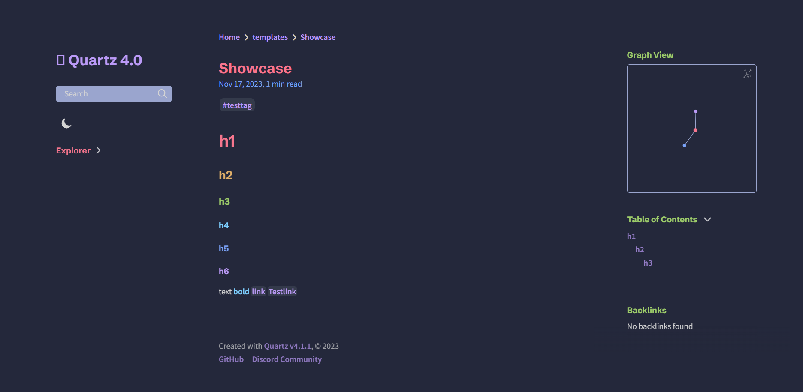
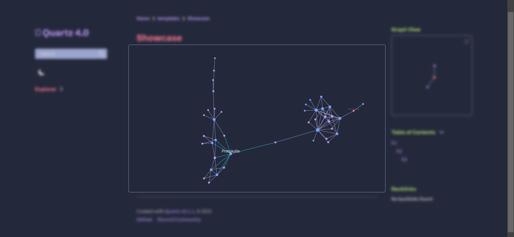
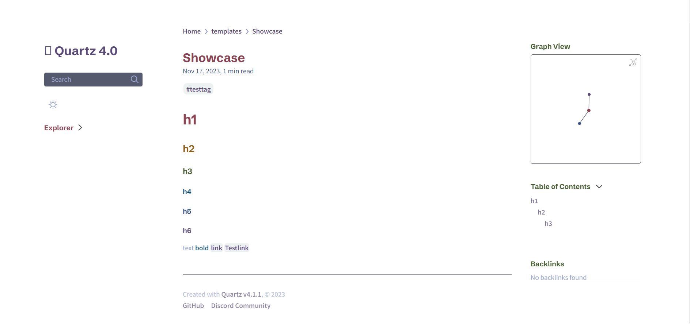
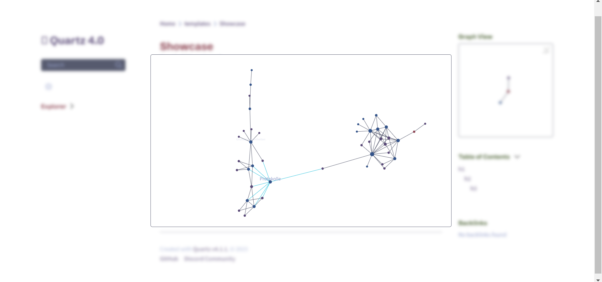

# Quartz-Theme-TokyoNight

This is a Tokyo Night color theme for Quartz 4 (Obsidian Look).

To use this theme, copy the `custom.scss` file into the `/quartz/styles` folder, and the `graph.inline.ts` file into the `/quartz/components/scripts` folder.

The `ts` file will only change the highlighting of the node's links, while the `scss` file will modify some basic colors.

Pageview (Darkmode):

Graphview (Darkmode):

Pageview (Lightmode):

Graphview (Lightmode):

